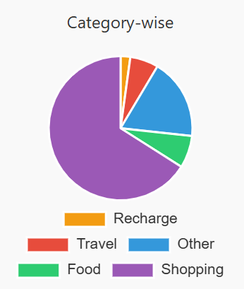
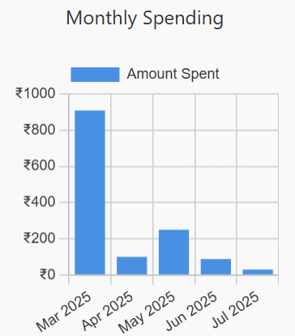

#  Daily Expense Tracker

A modern, Firebase-powered web app to **track daily expenses**, visualize spending, and manage your budget — built with **HTML, CSS, JavaScript, Firebase, and Chart.js**.
---


---

##  About the Project

The **Daily Expense Tracker** is a lightweight and intuitive web application that helps users to:

* Add, delete, and filter expenses.
* Sign up and log in with Firebase Authentication (Email/Password + Google).
* Store data securely in Firebase Firestore (user-specific).
* Export expense data to CSV.
* View **interactive Pie and Bar Charts** of monthly/weekly spending.
* Toggle between **Dark & Light mode**.


##  Live Demo

Try out the hosted app here: [https://daily-expense-tracker-99cce.web.app](https://daily-expense-tracker-99cce.web.app)

---

##  Key Features

🔹 **Firebase Authentication** (Email/Password + Google login)<br>
🔹 **Firestore Integration** — stores data securely per user<br>
🔹 **Add/Delete/Filter** expenses dynamically<br>
🔹 **Pie Chart + Bar Chart** using Chart.js<br>
🔹 **Export to CSV** for offline use<br>
🔹 **Responsive UI** with dark/light theme<br>
🔹 **Firebase Hosting Ready**<br>
🔹 **Optimized for performance & usability**

---

##  Tech Stack

| Frontend                | Backend/Database        | Libraries          |
| ----------------------- | ----------------------- | ------------------ |
| HTML, CSS, JS           | Firebase Authentication | Chart.js           |
| Tailwind CSS            | Firebase Firestore      | FileSaver.js (CSV) |
| LocalStorage (Fallback) |                         |                    |

---

##  Folder Structure

```
📁 daily-expense-tracker
├── 📁 public
│ ├── index.html          # Main HTML file
│ ├── script.js           # JavaScript logic
│ └── style.css           # Styling (Tailwind + Custom)
├── .firebaserc           # Firebase project config
├── .gitignore            # Ignored files
├── README.md             # Project overview
├── firebase.json         # Firebase hosting config
└── firebase-tools.json   # Firebase CLI config
```

---

##  Setup Instructions

### 1. Clone the Repository

```bash
git clone https://github.com/pawni1712/daily-expense-tracker.git
cd daily-expense-tracker
```

### 2. Open in VS Code / Browser

Make your changes in `public/index.html`, `style.css`, and `script.js`.

### 3. Firebase Setup (Required for Hosting & Auth)

* Create a Firebase Project [console.firebase.google.com](https://console.firebase.google.com)
* Enable **Authentication (Email/Password & Google)**
* Create Firestore DB
* Add your **firebaseConfig** in `index.html`

### 4. Deploy using Firebase Hosting

```bash
firebase login
firebase init
firebase deploy
```

---

## 📊 Charts Preview

| Pie Chart  | Bar Chart  |
| ------------ | ------------ |
|  |  |


---

##  Example CSV Export

Example of exported CSV:

```
Date, Category, Amount
2025-07-05, Food, ₹200
2025-07-05, Travel, ₹100
```

---

## 💡 Use Cases

* Personal daily budgeting
* Expense tracking for students & freelancers
* Financial planning tool for non-tech users

---

##  Future Improvements

* Budget limits with alerts
* Monthly summaries via email
* Firebase Cloud Functions for analytics
* Add Categories/Tags to expenses
* Sort by highest/lowest spending

---

## Author

**Pawni**  
B.Tech (IT), 3rd Year | Web Developer and UI/UX Enthusiast  
Passionate about building user-friendly, responsive, and impactful web applications.    
[GitHub Profile](https://github.com/pawni1712)


---

##  Show Some Love

If this project helped you or inspired you, please consider starring the repository.
Feedbacks, contributions, and issues are welcome — Happy Budgeting! 😊
